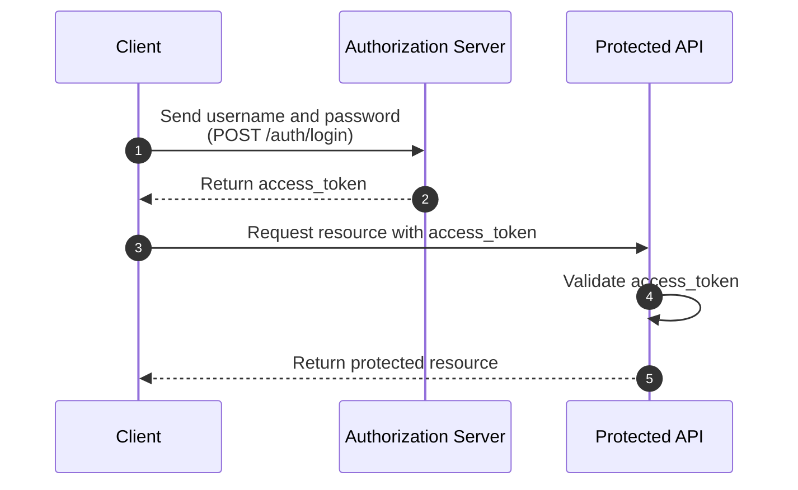
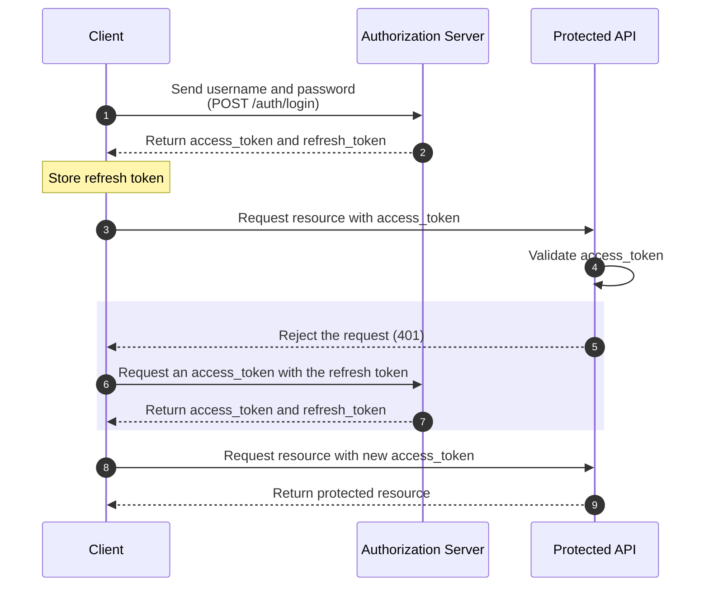

# Refresh Tokens: equilibrando segurança e usabilidade em aplicações!

<i>Photo by <a href="https://unsplash.com/@flyd2069?utm_source=unsplash&utm_medium=referral&utm_content=creditCopyText">FLY:D</a> on <a href="https://unsplash.com/s/photos/unit-test?utm_source=unsplash&utm_medium=referral&utm_content=creditCopyText">Unsplash</a></i>

## Sumário

- [Introdução](#introdução)
- [Problema](#problema)
- [Solução: refresh tokens!](#solução-refresh-tokens)
  - [O que é um access token?](#o-que-é-um-access-token)
  - [O que é um refresh token?](#o-que-é-um-refresh-token)
- [Autenticação com refresh token](#autenticação-com-refresh-token)
- [Finalizando...](#finalizando)

## Introdução

E ae dev, tudo bem com você?

Hoje vamos falar especificamente de uma das camadas mais utilizadas num fluxo "moderno" de autenticação. Você já ouviu falar de Refresh Tokens? Em resumo, "tokens de atualização" são credenciais utilizadas para obter credenciais/tokens de acesso. Complicado?

Calma fica comigo, pega um café e garanta sua leitura!

Bora pro post?

## Problema

Vamos criar uma cenário hipotético mas muito comum para quem está lidando com autenticação de aplicações. Imagine que um usuário queira acessar uma aplicação. Essa aplicação por sua vez possui uma tela de login onde o usuário precisará se autenticar para então acessar toda a parte interna da aplicação: dashboards, meu perfil, e etc.

Por questões de segurança, no momento em que o usuário se autenticou, foi definido que o tempo de sessão mínimo seja de apenas 5 minutos. O usuário então (sempre que expira a sua sessão) perde o acesso ao sistema, e deve inserir suas credenciais novamente para continuar navegando.

É evidente que o nosso usuário acaba tendo uma péssima experiência ao utilizar o nosso sistema...

Tendo isso em vista, conversamos com o time de segurança sobre aumentarmos o tempo de duração da sessão, mas isso implicaria em deixarmos a nossa aplicação menos segura para o nosso usuário...

Sendo assim, como evitar que os usuários tenham que realizar o login sempre que a sessão expire? Como equilibrar a segurança e a usabilidade na nossa aplicação?

## Solução: refresh tokens!

Primeiro, vamos entender um pouco do fluxo de autenticação que temos até então.

O _Client_ envia um usuário e senha para o servidor de autorização, as credenciais estando válidas o servidor devolve um _access_token_ para o _Client_. O Client pode (e deve) utilizar o _access_token_ nas requisições protegidas para as APIs. As APIs protegidas validam o _access_token_ e devolvem o recurso solicitado pelo _Client_.

Com o fluxo atual, é inevitável que o usuário tenha a experiência que falamos antes. Isto porque as APIs protegidas verificam sempre se o access_token é válido, para então devolver o recurso pro usuário.

Precisamos melhorar esse fluxo, incluindo o mecanismo de _refresh_token_!

Vamos primeiro entender qual é a diferença entre um `access_token` e de um `refresh_token`.

### O que é um access token?

O _access token_ é um JWT (JSON Web Tokens) que é utilizado pelo usuário para acessar as aplicações e os recursos protegidos. Esse token é codificado (não encriptado) e carrega algumas informações presentes no _Header_, _Payload_ e _Signature_ (seções que compõe a estrutura base de um token JWT).

Geralmente ele possui um tempo de vida útil **curto**.

> 💡 [jwt.io](https://jwt.io/): _JSON Web Tokens are an open, industry standard [RFC 7519](https://tools.ietf.org/html/rfc7519) method for representing claims securely between two parties._

### O que é um refresh token?

O _refresh token_ é um token utilizado para "renovar a sessão" de um usuário. Através dele podemos solicitar ao servidor de autorização para que seja gerado um novo _access token_ sem ter que pedir ao usuário que ele se logue novamente (desde que o token de atualização seja válido e não tenha expirado).

É importante entender que:

- Ele possui um **tempo de vida útil maior** do que o `access_token`;
- É um token apenas para gerar um novo token de acesso. Não pode ser utilizado para acessar a aplicação. Porém, se expirado, o usuário deve realizar o login novamente;
- Alguns IdPs ([Identity Providers](https://en.wikipedia.org/wiki/Identity_provider)) utilizam o _refresh token_ pra revogar as sessões ativas do usuário.

Estando claras as diferenças, vamos adaptar o nosso fluxo de autenticação!

## Autenticação com refresh token

No novo fluxo o _Client_, toda vez que tiver uma solicitação rejeitada pela API protegida, deve solicitar ao servidor de autorização um novo token de acesso (utilizando o _refresh token_ na solicitação). O servidor de autorização valida a solicitação (verificando se o _refresh token_ está válido e não expirado) e concede ao _Client_ o token de acesso.

Verificando as alterações no novo fluxo de autenticação:

- Além de retornar o `access_token`, também retornamos o `refresh_token` durante o login do usuário (no `POST /auth/login`);
- Adicionamos um nova rota no _Authorization Server_ para possibilitar que o _Client_ possa renovar a sua sessão (o `POST /auth/refresh`);

## Finalizando...

Bem, é isso, por hoje, é só!

Quero te agradecer por chegar até aqui, e queria lhe pedir também para me encaminhar as suas dúvidas, comentários, críticas, correções ou sugestões sobre a publicação.

Deixe seu ❤️ se gostou ou um 🦄 se esse post te ajudou de alguma maneira! Não se esqueça de ver os posts anteriores e me siga para maaaais conteúdos.

Até!
